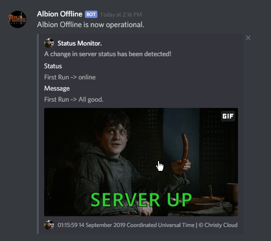
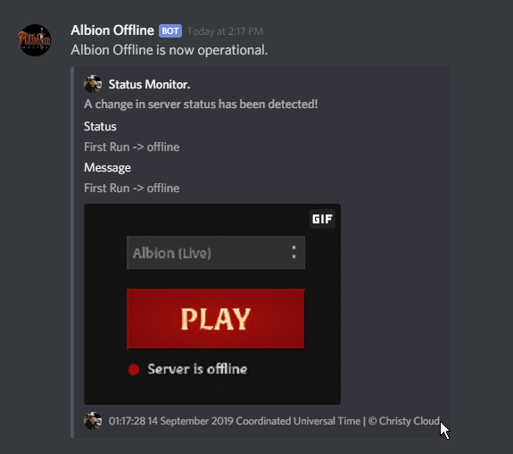

# Albion Offline

This is the source repository for the Albion Offline discord bot - If you are looking to add the bot to your server, then you can do so by visiting. [This Link](https://discordapp.com/oauth2/authorize?client_id=622384942755610624&scope=bot&permissions=3072).

Once the bot has joined your server, verify that the `Albion Offline` role can view the channel, and then have any user with the "Administrator", "Manage Server" or "Manage Channel" Discord permissions, enable the bot by sending `@status toggle` to the channel you would like to recieve updates. Repeat these steps for any other channels you would like to receive notifications.

# What does it do?
Albion Offline is a Discord bot which provides live updates regarding the Albion Online server status, some examples of notifications, can be seen below.

# Other Projects
If you found the Albion Offline bot useful, then check out my other Albion Online projects, current plans include integrated guild authentication with member tracking and an automatic replacement approval/denial system with web ui for crafters.
